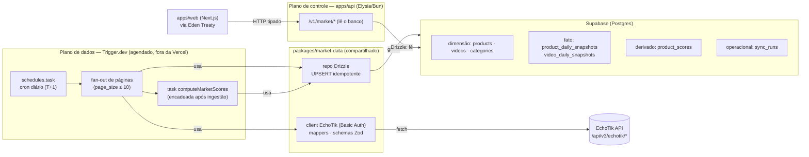

# Ingestão e Sincronização de Dados — EchoTik → Supabase via Trigger.dev

**Data:** 2026-06-10
**Status:** Documento de arquitetura (decisões travadas + desenho de implementação)
**Escopo:** Como sair do *"pull direto a cada request"* para um **histórico próprio acumulado**, sincronizado da EchoTik para o **Supabase** por jobs agendados no **Trigger.dev**, e servido ao produto **a partir do banco**.
**Relação:** Concretiza [infra.md §5 (Ingestão)](./infra.md) e §6 (Armazenamento). **Diverge** do infra.md em dois pontos — Trigger.dev no MVP (não Inngest) e Supabase (não Neon) — ver §11.

> **Aviso.** Preços/limites são *snapshots* de jun/2026 — reconfirme na fonte. A EchoTik está em **assinatura paga** (desde 2026-06-10; o trial de 100 requests esgotou nos testes). Atenção: a **cota da open-API é um teto liberado manualmente por admin — não escala sozinha com a assinatura**, então segue como a restrição que domina este desenho (`page_size ≤ 10`). Ver [fornecedores.md §1.1](./fornecedores.md) e [docs/echotik/api/README.md](./echotik/api/README.md).

---

## 1. Por que persistir — o problema

### 1.1 Estado atual

Hoje o `apps/api` (Elysia/Bun :3333) **busca da EchoTik no momento em que a tela carrega**, com cache em memória de 5 min ([client.ts](../apps/api/src/data-source/adapters/echotik/client.ts)). Não há banco. Consequências:

- **`getMarketTrend()` lança 501** e cai no mock — porque *série temporal de mercado não existe na EchoTik* ([echotik/index.ts](../apps/api/src/data-source/adapters/echotik/index.ts)).
- Cada visita gasta **cota da EchoTik** — que é um teto manual, não escala sozinho. Insustentável a cada page-load.
- O histórico vive só nos 5 min do cache: **nada é acumulado**.

### 1.2 O princípio central

> **A EchoTik entrega "hoje", não "a história".** Os endpoints dão o ranking do dia (`product/ranklist`) e snapshots por entidade (`product/trend`, até 180 d retroativos, por `product_id` individual). **Não há endpoint de série temporal do *mercado*.**

Mas o núcleo do TIKSPY — **aceleração**, **z-score de momentum**, classificação **emergente vs saturado**, o **SCORE** ([infra.md §8](./infra.md)) — **exige uma série**. Logo a sincronização **não é cache**: é **construir o nosso próprio histórico**, um snapshot diário de cada vez, no nosso banco. Esse é o real motivo de "alimentar o banco". Sem isso, o produto nunca passa de um espelho do dia atual.

### 1.3 As três forças que empurram pra persistência

| Força | Hoje (pull direto) | Com persistência |
|---|---|---|
| **Série temporal** | Inexistente — só o instante atual | Acumulada por nós; destrava aceleração/emergentes/SCORE/trend |
| **Cota / custo** | Gasta requests a cada page-load | Sincroniza **1×/dia**; UI lê do banco (0 requests); o passado **não é rebuscado** |
| **`page_size ≤ 10`** | Paginar a cada request é lento e caro | Pagina 1×/dia no job; a UI nunca pagina a EchoTik |

> **Ganho de cota não-óbvio.** Ao persistir, você **para de rebuscar o passado**. O adapter atual busca "hoje" *e* "ontem" toda vez pra calcular o delta. Com o banco, "ontem" já está gravado — você busca só a **fatia nova** (hoje) e compara com o que já existe. Menos requests, mais histórico.

---

## 2. Decisões travadas

| Decisão | Escolha | Por quê (resumo) |
|---|---|---|
| **Banco** | **Supabase** (Postgres) | Postgres gerenciado + Auth/Storage/Realtime/RLS na mesma plataforma. O *auto-pause* do free **não nos afeta**: o sync diário mantém o banco ativo. Substitui o Neon do infra.md (§11). |
| **Acesso ao banco** | **Drizzle ORM** | TS-first, migrations versionadas, `UPSERT` idempotente (`onConflictDoUpdate`), tipagem end-to-end. Runtime-agnóstico (Bun + Node), casa com o Zod já no projeto. |
| **Modelo de dados** | **Snapshot tipado por entidade** | Dimensão (`products`, `videos`) + fato tipado (`*_daily_snapshots`), chave natural `(entity_id, dt, region)`. Colunas tipadas → índice e agregação eficientes; alinhado com infra.md §6. |
| **Onde a ingestão executa** | **Tasks do Trigger.dev** | É o "plano de dados" (infra.md, princípio 4): compute sem timeout, retry por task, agendamento. O `apps/api` fica só com leitura. |
| **Código compartilhado** | **`packages/market-data`** | O client/mappers/schemas EchoTik saem do `apps/api` e sobem pra um pacote usado **por tasks e pela API** — regra do [CLAUDE.md](../CLAUDE.md) (promover a `packages/` quando 2+ usam). |
| **Fonte primária** | **EchoTik** (region `BR`), v3 | Já validada (BR confirmado). A coluna `source` deixa uma 2ª fonte (Apify/scraping) alimentar **as mesmas tabelas** no futuro. |

---

## 3. Visão geral da arquitetura



**Leitura do diagrama.** O Trigger.dev acorda de madrugada, dispara as páginas do ranking em leque, cada uma chama a EchoTik (via `packages/market-data`), normaliza e faz `UPSERT` no Supabase; ao terminar, encadeia o cálculo de scores. O `apps/api` **nunca toca a EchoTik** — só lê o Supabase com Drizzle e serve o `apps/web` (contrato Eden inalterado).

> ### ⚠️ Distinção que evita o erro de modelagem nº 1
> **Os dados de mercado são GLOBAIS, não multi-tenant.** O ranking BR de produtos é o mesmo pra todos os clientes do TIKSPY — `products` e `*_daily_snapshots` **não levam `tenant_id` nem RLS de tenant**; são tabelas de leitura compartilhada. O **RLS por tenant** ([infra.md §7.2](./infra.md)) aplica-se às tabelas de **usuário** (contas, *watchlists*, `alert_rules`) — que são outro documento. Não misture as duas camadas.

---

## 4. Modelo de dados (Supabase + Drizzle)

### 4.1 Princípios

- **Dimensão × fato.** Dimensão = *quem é a entidade* (atributos estáveis: nome, categoria, loja). Fato = *como ela estava num dia* (uma linha por entidade × dia × região).
- **Chave natural + `UPSERT`.** PK composta `(entity_id, dt, region)`. Re-rodar o mesmo dia **sobrescreve** a linha (idempotente), nunca duplica ([infra.md §5.2](./infra.md)).
- **Snapshot acumulado vs incremento.** A EchoTik mistura ambos. Guardamos os dois: `*_cnt` (acumulado desde sempre) e `*_1d` (ganho do dia). O ganho diário também pode ser derivado por `dt − (dt-1)` quando só houver acumulado (caso de `product/trend`).
- **`source` em todo fato.** Permite uma 2ª fonte (Apify/scraping) coexistir e reconciliar.

### 4.2 Esquema (Drizzle, ilustrativo)

```ts
// packages/market-data/src/db/schema.ts
import {
  pgTable, text, integer, numeric, date, timestamp, primaryKey, index,
} from "drizzle-orm/pg-core"

// ── Dimensão: quem é o produto (atributos relativamente estáveis) ──
export const products = pgTable("products", {
  productId: text("product_id").primaryKey(),
  region: text("region").notNull(),
  name: text("name").notNull(),
  categoryId: text("category_id"),       // FK lógica → categories
  sellerId: text("seller_id"),
  commissionRate: numeric("commission_rate"),
  firstSeenAt: timestamp("first_seen_at").defaultNow(),
  lastSyncedAt: timestamp("last_synced_at").defaultNow(),
})

// ── Fato: a "foto" do produto num dia (1 linha por produto × dia × região) ──
export const productDailySnapshots = pgTable(
  "product_daily_snapshots",
  {
    productId: text("product_id").notNull(),
    dt: date("dt").notNull(),
    region: text("region").notNull(),
    rankPosition: integer("rank_position"),       // posição no ranking do dia
    salesCnt: integer("sales_cnt").notNull().default(0),  // acumulado
    sales1d: integer("sales_1d").notNull().default(0),    // ganho do dia
    gmvAmt: numeric("gmv_amt").notNull().default("0"),
    gmv1d: numeric("gmv_1d").notNull().default("0"),
    videoCnt: integer("video_cnt").notNull().default(0),
    liveCnt: integer("live_cnt").notNull().default(0),
    iflCnt: integer("ifl_cnt").notNull().default(0),      // # criadores vendendo
    source: text("source").notNull().default("echotik"),
    ingestedAt: timestamp("ingested_at").defaultNow(),
  },
  (t) => ({
    pk: primaryKey({ columns: [t.productId, t.dt, t.region] }),
    byRegionDt: index("psnap_region_dt_idx").on(t.region, t.dt),
  }),
)

// videoDailySnapshots segue o mesmo padrão:
// (videoId, dt) PK; viewsCnt, views1d, diggCnt, commentsCnt, sharesCnt,
// saleCnt, saleGmvAmt, source, ingestedAt.
```

`UPSERT` idempotente (convergência em re-run):

```ts
await db.insert(productDailySnapshots).values(rows).onConflictDoUpdate({
  target: [productDailySnapshots.productId, productDailySnapshots.dt, productDailySnapshots.region],
  set: {
    salesCnt: sql`excluded.sales_cnt`,
    gmvAmt: sql`excluded.gmv_amt`,
    rankPosition: sql`excluded.rank_position`,
    ingestedAt: sql`now()`,
    // ...demais colunas
  },
})
```

### 4.3 Tabelas

| Tabela | Camada | Chave | Papel |
|---|---|---|---|
| `products` | Dimensão | `product_id` | Atributos estáveis do produto; `last_synced_at` para frescor |
| `videos` | Dimensão | `video_id` | Criativo: título, capa, `creator_unique_id` |
| `categories` | Dimensão | `id` | L1/L2/L3 + `name` — **resolve o `category: "—"`** dos mappers atuais |
| `product_daily_snapshots` | Fato | `(product_id, dt, region)` | Série diária de vendas/GMV/vídeos — **a espinha dorsal** |
| `video_daily_snapshots` | Fato | `(video_id, dt)` | Série diária de views/engajamento/vendas do criativo |
| `product_scores` | Derivado | `(product_id, dt, region)` | SCORE + subscores + classificação (§9). Pode ser *materialized view* no MVP |
| `sync_runs` | Operacional | `id` | Auditoria de cada job: requests gastos, linhas upsertadas, status, erro (§10) |

### 4.4 Particionamento (alvo, não MVP)

`*_daily_snapshots` crescem linearmente no tempo. **No MVP**: tabela simples com a PK composta + índice `(region, dt)` — suficiente por dezenas de milhões de linhas. **Gatilho de migração** ([infra.md §6](./infra.md)): quando agregações ficarem lentas → particionar por `RANGE (dt)` mensal com **`pg_partman`** (nativo do Postgres). **Não usar TimescaleDB** — está descontinuado no Supabase. A PK já inclui `dt`, então a migração não muda o código de escrita.

---

## 5. O que sincronizar — catálogo de jobs

Endpoints na **v3** (`/api/v3/echotik/*`) — o adapter atual usa v2 (capada); **migrar para v3 é pré-requisito** (destrava título de vídeo, GMV, janelas 1d/7d/30d, nomes de categoria e os endpoints de `trend`). Ver [README dos endpoints](./echotik/api/README.md).

| Job | Fonte (v3) | Cadência | Chave natural | Custo* | Prioridade |
|---|---|---|---|---|---|
| **Ranking diário de produtos** | `product/ranklist` (`product_rank_field=1`, `rank_type=1`, `date`) | Diária (T+1) | `(product_id, dt, region)` | ~`páginas` req/dia | **P0 — espinha dorsal** |
| **Criativos / vídeos trending** | `video/ranklist` ou `video/list` (janelas `_1d/7d/30d`) | Diária | `(video_id, dt)` | ~`páginas` req/dia | P0 |
| **Nomes de categoria** | `product/category` (L1/L2/L3) | Semanal / on-demand | `id` | ~3 req | P1 — mata o `"—"` |
| **Backfill de série (180 d)** | `product/trend` · `video/trend` | On-demand | `(entity_id, dt)` | `⌈180/10⌉ = 18` req/entidade | P1 — só p/ watchlist/top |
| **Migração v2 → v3** | (refactor do client) | Uma vez | — | 0 | **P0 — pré-requisito** |

*\*Custo em requests: `páginas` = quantas páginas de `page_size=10`. Top 20 = 2; top 100 = 10.*

> **Backfill é caro — use com cirurgia.** 180 dias de um produto = 18 requests (1.8 paginações de 10). É o jeito de **encher a série de uma entidade sem esperar 180 dias acumulando**, mas com a cota num teto manual, 18 requests por entidade pesa. Reserve para produtos que entram numa *watchlist* ou no top do dia — nunca em varredura.

---

## 6. Execução com Trigger.dev

### 6.1 Estrutura

```
packages/market-data/        # client EchoTik + mappers + schemas + repo Drizzle
  src/
    client.ts  mappers.ts  schemas.ts
    db/ schema.ts  repo.ts
trigger.config.ts            # defineConfig({ project, dirs: ["./src/trigger"] })
src/trigger/
  market-sync.ts             # tasks de sincronização
  scoring.ts                 # task de cálculo de SCORE
```

### 6.2 Desenho das tasks

Três peças: um **orquestrador agendado**, uma **task-folha idempotente** (1 página → banco) e uma **task de scoring** encadeada.

```ts
// src/trigger/market-sync.ts  — sintaxe Trigger.dev v4 (confirmar na versão instalada)
import { schedules, task, queue } from "@trigger.dev/sdk"
import { fetchProductRankPage, upsertProductSnapshots } from "@workspace/market-data"
import { computeMarketScores } from "./scoring"

// Fila dedicada: 1 request por vez à EchoTik — respeita QPS e protege a cota.
const echotik = queue({ name: "echotik", concurrencyLimit: 1 })

// Task-folha: 1 página do ranking → UPSERT. Retentável e idempotente.
export const syncRankPage = task({
  id: "sync-rank-page",
  queue: echotik,
  retry: { maxAttempts: 5, factor: 2, minTimeoutInMs: 1_000, maxTimeoutInMs: 60_000 },
  run: async ({ region, date, page }: { region: string; date: string; page: number }) => {
    const items = await fetchProductRankPage({ region, date, page })
    const rows = await upsertProductSnapshots(items, { region, date })
    return { page, rows }
  },
})

// Orquestrador agendado: dispara as páginas em leque e encadeia o scoring.
export const dailyMarketSync = schedules.task({
  id: "daily-market-sync",
  cron: "0 9 * * *", // 09:00 UTC — depois do T+1 da EchoTik
  run: async (payload) => {
    const region = "BR"
    const date = yesterday(payload.timestamp) // T+1
    const pages = budgetedPages() // [1, 2] dentro do teto atual; sobe quando o admin liberar cota (§7)

    // Fan-out idempotente: re-run do mesmo dia NÃO duplica (idempotencyKey + UPSERT).
    await syncRankPage.batchTriggerAndWait(
      pages.map((page) => ({
        payload: { region, date, page },
        options: { idempotencyKey: `rank:${region}:${date}:${page}` },
      })),
    )

    // Só depois que os snapshots do dia entraram, calcula os scores.
    await computeMarketScores.trigger({ region, date })
  },
})
```

### 6.3 Idempotência em duas camadas

1. **`idempotencyKey` no Trigger.dev** (`rank:BR:2026-06-09:1`): se o orquestrador for re-disparado (retry, replay), a página **não é reprocessada** — devolve o resultado anterior. Protege a cota.
2. **`UPSERT` no banco**: se a página *for* reprocessada (janela de idempotência expirou, backfill manual), o `onConflictDoUpdate` **sobrescreve** a linha. Convergência garantida ([infra.md §5.2](./infra.md)).

### 6.4 Concorrência e cota

- **`queue({ concurrencyLimit: 1 })`** serializa as chamadas à EchoTik — nunca dois requests simultâneos, respeitando QPS e o orçamento de cota.
- **Retry com backoff exponencial** (`factor: 2`) absorve o `code=500 / Usage Limit Exceeded` da EchoTik sem derrubar o run.
- O orquestrador decide **quantas páginas** pedir a partir do orçamento (§7) — o limite vive em env, não no código.

---

## 7. Estratégia de cota (teto manual)

A cota é a restrição dominante. A EchoTik está em **assinatura paga** (desde 2026-06-10; o trial de 100 requests esgotou nos testes), mas a cota da open-API é **liberada manualmente por um admin — não escala sozinha com a assinatura**. Na prática: você vive dentro do teto atual e **pede aumento quando precisa**. Desenho **budget-aware por padrão**, destravável por configuração conforme o teto sobe.

| Item | Dentro do teto atual | Quando o admin liberar mais |
|---|---|---|
| `page_size` | **≤ 10** (fixo) | confirmar se sobe no plano |
| Ranking/dia | 2 páginas (top 20) | 10 páginas (top 100) |
| Vídeos/dia | 2 páginas | 10 páginas |
| Backfill 180 d | **evitar** (18 req/entidade) | sob demanda p/ watchlist |
| Custo diário | **~4 requests** | ~20–25 requests |

Mecanismos:

- **`ECHOTIK_DAILY_REQUEST_BUDGET`** (env): teto de requests por run. O orquestrador conta o consumo em `sync_runs` e **para** ao atingir o teto — falha visível, não silenciosa.
- **`pages` parametrizável** por env, não hard-coded — sobe quando a cota subir.
- **Cache** (TTL 5 min via `ECHOTIK_CACHE_TTL_MS`) protege contra rajadas acidentais no client.
- **Sem real-time em loop:** os endpoints `*/real-time` puxam direto do TikTok, sofrem *risk control* e não suportam QPS — só sob demanda pontual, nunca em job de varredura.
- **O passado não é rebuscado** (§1.3): o delta sai do banco, não de nova chamada.
- **`Usage Limit Exceeded`:** quando a cota estoura, a EchoTik devolve HTTP 500 *"Usage Limit Exceeded, Please Contact Administrator to Increase Quota"*. O retry com backoff segura o run, mas a saída real é **pedir aumento ao admin** — não martelar a API.

---

## 8. Servir do banco — o que muda no `apps/api`

### 8.1 A nova fronteira

A interface `MarketDataSource` atual **mistura** "buscar do fornecedor" com "servir o produto". Com persistência, isso se separa:

| Antes | Depois |
|---|---|
| `apps/api` chama o adapter EchoTik a cada request | **`packages/market-data`** = adapters de **fornecedor** (EchoTik, mock) → usados **só pela ingestão** |
| Adapter devolve dados crus pra UI | **`apps/api/repository`** (Drizzle) = **lê o nosso banco** → serve `/v1/market/*` |
| `MARKET_DATA_SOURCE=echotik\|mock` escolhe o que a UI vê | A seleção migra pra **ingestão** (qual fornecedor alimenta o banco). A **API sempre lê o banco** |

### 8.2 Efeitos

- **`getMarketTrend()` passa a funcionar.** A série que não existe na EchoTik **existe no nosso banco** — `SELECT dt, SUM(gmv_1d), ... GROUP BY dt`. Cai o `501`/mock para este bloco.
- **Contrato `/v1/market/*` não muda** → `apps/web` (Eden Treaty) **não é tocado**. Ver [memória da API](../apps/api/src/index.ts).
- **`x-data-source`** passa a refletir a procedência real (`db` com origem `echotik`), mantendo a sinalização de origem para a UI.
- **Conexão Supabase no Elysia:** processo persistente → *session pooler* (porta 5432) ou conexão direta. As **tasks** (efêmeras) usam o *transaction pooler* (6543) com `prepare: false` no driver `postgres`. Detalhe de implementação, não de arquitetura.

### 8.3 Modo desenvolvimento

Sem `DATABASE_URL` (ou `MARKET_DATA_SOURCE=mock`), o `apps/api` lê do **mock** direto — o produto continua demonstrável sem banco nem credencial, como hoje.

---

## 9. Inteligência sobre a série (scoring)

Hoje o [`computeScores`](../apps/api/src/data-source/score.ts) roda **percentil intra-dia** sobre o cohort do request — não há momentum porque não há série. Com o histórico acumulado:

- **Aceleração:** z-score sobre o **log-crescimento** de `sales_1d` numa janela móvel (7/14/30 d) — "subiu 3 desvios acima da média de 14 dias" ([infra.md §8.1](./infra.md)).
- **Emergente vs saturado:** quadrante demanda × concorrência (`ifl_cnt` como proxy de saturação) + persistência do sinal por N períodos.
- **SCORE explicável:** percentil + média geométrica ponderada (o baseline já existe em `score.ts`), agora com o eixo de **aceleração** que só a série permite.

**Onde roda:** task **`computeMarketScores`** encadeada após a ingestão diária (§6.2), lendo os snapshots recentes e gravando `product_scores` (SCORE + subscores + classificação + `components` JSONB para explicabilidade). No MVP pode ser uma *materialized view* com refresh pós-ingestão; vira task dedicada quando a lógica crescer.

---

## 10. Idempotência, reconciliação e observabilidade

- **`UPSERT` + `idempotencyKey`** (§6.3) — convergência garantida.
- **`sync_runs`** registra cada job (task, região, data-alvo, status, `requests_used`, `rows_upserted`, `started_at`, `finished_at`, `error`) — é a base do **orçamento de cota** e do **job de reconciliação**.
- **Reconciliação periódica:** compara contagens/PKs do banco contra a fonte e faz *backfill* de lacunas ([infra.md §5.2](./infra.md)). Sem isso, um dia perdido vira um buraco silencioso na série que distorce o z-score.
- **Observabilidade:** o Trigger.dev já dá logs/traces por run; erros de produto → Sentry ([infra.md §10.1](./infra.md)).
- **Segredos/env:** `ECHOTIK_USERNAME` · `ECHOTIK_PASSWORD` · `ECHOTIK_BASE_URL` · `ECHOTIK_DAILY_REQUEST_BUDGET` (tasks) · `DATABASE_URL` Supabase (tasks + `apps/api`) · `TRIGGER_SECRET_KEY`/project. Nas tasks, vivem nas env vars do Trigger.dev; no `apps/api`, no ambiente do Elysia.

---

## 11. Divergências com o infra.md (a reconciliar)

Este documento **prevalece** sobre o infra.md nos dois pontos abaixo; o infra.md será atualizado para não se contradizer.

| Tema | infra.md (atual) | Esta arquitetura | Justificativa |
|---|---|---|---|
| **Orquestração** | Inngest (MVP) → Trigger.dev (escala) | **Trigger.dev desde o MVP** | Evita a migração Inngest→Trigger; compute sem timeout e self-hostável já no início. Decisão do usuário. |
| **Banco (OLTP)** | Neon Postgres | **Supabase Postgres** | Auth/Storage/Realtime/RLS no mesmo lugar; auto-pause neutralizado pelo sync diário. Decisão do usuário. |

**Ação:** atualizar [infra.md §5.1, §6.1, §11 e §12](./infra.md) (tabelas de stack e roadmap) para Trigger.dev + Supabase. Pendência registrada.

---

## 12. Roadmap por fases

### Fase 0 — MVP (trial, validar o pipeline ponta a ponta)
- [ ] Criar **`packages/market-data`**: mover client/mappers/schemas EchoTik do `apps/api`; migrar **v2 → v3**.
- [ ] **Schema Drizzle** no Supabase: `products`, `product_daily_snapshots`, `sync_runs` + migrations.
- [ ] Task **`dailyMarketSync`** (ranking top 20, budget-aware) + `syncRankPage` idempotente.
- [ ] `apps/api` passa a **ler do banco** (repository Drizzle); **`getMarketTrend()` funciona**.
- [ ] `computeMarketScores` simples (materialized view ou task) gravando `product_scores`.

### Fase 1 — Contrato (endurecer e ampliar)
- [ ] Subir cota (top 100, após liberação do admin); adicionar **vídeos/criativos** e **categorias** (mata o `"—"`).
- [ ] **Backfill 180 d** on-demand para watchlist/top; **reconciliação** periódica.
- [ ] **Particionamento** `pg_partman` quando o volume pedir; índices revisados.
- [ ] Adicionar dimensões **`shops`** e **`creators`**.
- [ ] Ler licença de revenda EchoTik (pendência de [fornecedores.md §1.1](./fornecedores.md)).

### Fase 2 — Escala (moat)
- [ ] Mais regiões; **2ª fonte** (Apify/scraping) alimentando **as mesmas tabelas** via coluna `source` + reconciliação.
- [ ] Migrar séries para ClickHouse/Tinybird **se** as agregações ficarem lentas (gatilho do infra.md §6).
- [ ] Inteligência intermediária (STL/EWMA + anomalia em resíduo).

---

## 13. Pontos abertos (decisões de produto)

Não bloqueiam o pipeline, mas precisam de decisão antes de "produção":

- **Limiares de negócio** (`BESTSELLER_MIN_SALES_24H`, `VIRAL_MIN_VIEWS_24H`, corte de "emergente") — provisórios em [consts.ts](../apps/api/src/data-source/consts.ts), revisar com dados reais acumulados.
- **Pesos do SCORE** (`sales 0.5 / gmv 0.35 / videos 0.15`) — baseline v0, calibrar.
- **Retenção de snapshots** — guardar série completa ou compactar/agregar após N meses?
- **Cadência por plano** — todos veem T+1, ou planos premium têm sync mais frequente ([infra.md §9](./infra.md))?
- **Regiões além de BR** — quando, e a que custo de cota?
</content>
</invoke>
